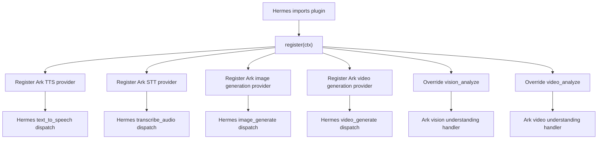

# Hermes Ark Plugin System Design

## Goals

- Keep all Volcengine Ark implementation code outside Hermes core.
- Package Ark TTS, STT, image generation, video generation, image understanding,
  and video understanding as one independently maintained plugin.
- Reuse Hermes' existing plugin loading and `plugins.entries.<plugin_id>`
  configuration namespace.
- Preserve Hermes-facing tool names:
  `text_to_speech`, `transcribe_audio`, `image_generate`, `video_generate`,
  `vision_analyze`, and `video_analyze`.
- Avoid changing Hermes core files.

## Non-Goals

- Add a new Hermes core provider registry for image/video understanding.
- Introduce new public tool names such as `ark_vision_analyze`.
- Store secrets directly in `config.yaml`.
- Replace Hermes' CLI/TUI/gateway surfaces.

## Existing Hermes Hook Points

### Provider Registry Hooks

Hermes already exposes provider registries for four capabilities:

```python
ctx.register_tts_provider(...)
ctx.register_transcription_provider(...)
ctx.register_image_gen_provider(...)
ctx.register_video_gen_provider(...)
```

These hooks keep the Hermes tool shell intact. The model still calls the same
Hermes tool, while the tool dispatches to the configured provider:

```yaml
tts.provider: ark
stt.provider: ark
image_gen.provider: ark
video_gen.provider: ark
```

Use provider registry hooks for:

- `text_to_speech`
- `transcribe_audio`
- `image_generate`
- `video_generate`

### Tool Override Hooks

Hermes currently does not expose provider registries for image understanding
or video understanding. Since core must not change, the plugin uses explicit
tool override:

```python
ctx.register_tool(
    name="vision_analyze",
    toolset="vision",
    schema=VISION_ANALYZE_SCHEMA,
    handler=ark_vision_analyze,
    is_async=True,
    override=True,
)

ctx.register_tool(
    name="video_analyze",
    toolset="video",
    schema=VIDEO_ANALYZE_SCHEMA,
    handler=ark_video_analyze,
    is_async=True,
    override=True,
)
```

Use tool override for:

- `vision_analyze`
- `video_analyze`

The overridden tools must keep Hermes-compatible schemas and JSON response
envelopes.

## Plugin Layout

```text
hermes-ark-plugin/
  plugin.yaml
  __init__.py
  requirements.txt
  cli.py
  README.md
  DESIGN.md
  providers/
    __init__.py
    text_to_speech.py
    transcribe_audio.py
    image_generate.py
    video_generate.py
  tools/
    __init__.py
    vision_analyze.py
    video_analyze.py
  common/
    __init__.py
    config.py
    auth.py
    http.py
    media.py
```

## Registration Flow



## Configuration Model

Hermes-owned provider selection remains in the native sections:

```yaml
tts:
  provider: ark
stt:
  enabled: true
  provider: ark
image_gen:
  provider: ark
video_gen:
  provider: ark
```

Ark-owned implementation details live under:

```yaml
plugins:
  entries:
    ark:
      ...
```

This matches Hermes' existing per-plugin configuration convention used by
`plugins.entries.<plugin_id>`.

## CLI Design

The plugin ships a standalone CLI:

```bash
python cli.py install
python cli.py uninstall
python cli.py config
python cli.py status
```

### install

- Creates `~/.hermes/plugins/ark`.
- Defaults to copying this plugin repository into the Hermes plugin directory.
- Supports `--symlink` for local development.
- Enables `ark` in `plugins.enabled`.
- Optionally installs `requirements.txt` into the active Hermes Python.

### uninstall

- Removes `~/.hermes/plugins/ark`.
- Removes `ark` from `plugins.enabled`.
- Adds `ark` to `plugins.disabled` only when requested.
- Preserves `plugins.entries.ark` by default.
- Removes `plugins.entries.ark` with `--remove-config`.

### config

- Uses Hermes' `hermes_cli.config.load_config()` for read-only status checks.
- Writes the full `plugins.enabled` + `plugins.entries.ark` Ark block.
- Patches raw `config.yaml` instead of saving Hermes' merged defaults, so
  unrelated user config stays untouched.
- Optionally switches native provider selectors to `ark`.
- Does not write raw secrets. It writes `${ARK_AGENT_PLAN_API_KEY}` by default.

Default command:

```bash
python cli.py config
```

### status

- Shows install path, symlink/copy mode, enabled state, provider selector state,
  and whether `plugins.entries.ark` exists.

## Dependency Policy

Dependencies are declared in `requirements.txt` with upper bounds.

Current planned dependencies:

```text
httpx>=0.28.1,<1
websocket-client>=1.7,<2
```

The plugin CLI may install dependencies into the current Hermes venv, but
Hermes ordinary plugin loading does not auto-install them today.

## Risk Controls

- Tool override is explicit and auditable through Hermes plugin logs.
- Override handlers keep the original tool names and response envelopes.
- `vision_analyze` and `video_analyze` schemas should be copied from the
  active Hermes version at plugin release time and covered by compatibility
  tests.
- Provider registry paths are preferred wherever available to avoid copying
  core tool behavior.

## Migration From Current Split Plugins

Current split plugin/config shape:

```text
~/.hermes/plugins/tts/volc-ark
~/.hermes/plugins/stt/volc-ark
~/.hermes/plugins/image_gen/volc-seedream
~/.hermes/plugins/video_gen/volc-seedance
```

Target shape:

```text
~/.hermes/plugins/ark
```

Migration steps:

1. Install `ark`.
2. Run `python cli.py config`.
3. Disable old split plugins.
4. Verify all six Hermes tool names.
5. Remove old split plugins after successful verification.
